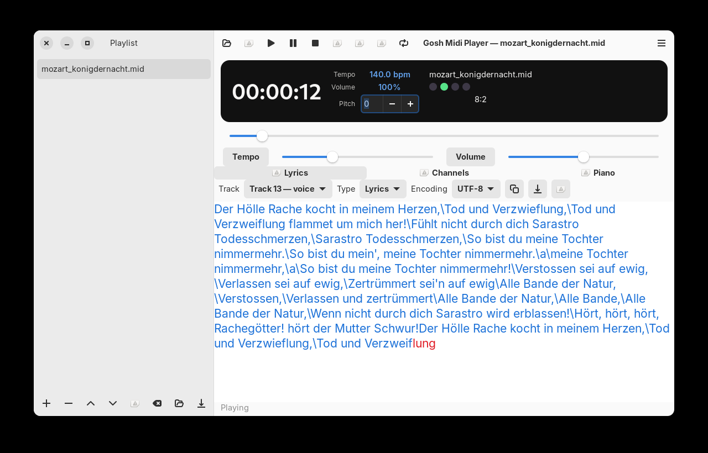

Drumstick MIDI File Player (GTK4 / libadwaita)
==============================================

[](https://github.com/pedrolcl/dmidiplayer/actions/workflows/linux-build.yml)

A MIDI file player for Linux with a GTK4 and libadwaita interface. It reads
**.MID** / **.MIDI** (Standard MIDI Files), **.KAR** (Karaoke), **.RMI** (RIFF RMID),
and **.WRK** (Cakewalk) files, and sends MIDI events to ALSA sequencer ports or to
an embedded FluidSynth backend.

This is a full rewrite of the former Qt/Drumstick UI. Playback features are
kept at parity, and **playlists are a first-class sidebar** instead of a
separate dialog.



Key features
------------

* MIDI output to ALSA hardware/soft-synth ports (MT-32, SC-55, USB MIDI, Munt),
  FluidSynth with your own SoundFont, or a dummy sink
* Instrument maps and SysEx resets for GM, GS (SC-55), XG, and MT-32
* Automatic companion `.syx` loading (same name as the MIDI file, or `Folder.syx`)
* Transpose song tonality between -12 and +12 semitones (percussion excluded)
* Change MIDI volume (CC7) from 0% to 200%
* Scale song speed between 50% and 200% tempo
* Lyrics, piano, MIDI channels, and rhythm views
* Playlists (`.lst`): add/remove/reorder/shuffle, save/load, next/previous,
  auto-advance, repeat song or whole list
* Supports MID/KAR/RMI (Standard MIDI Files) and WRK (Cakewalk)

Build requirements
------------------

* C++17 compiler
* GTK 4.14+ and libadwaita 1.5+
* ALSA, FluidSynth, uchardet
* CMake 3.16+

```
$ sudo apt install cmake g++ pkg-config libgtk-4-dev libadwaita-1-dev \
        libasound2-dev libfluidsynth-dev libuchardet-dev
$ cmake -S . -B build -DCMAKE_BUILD_TYPE=RelWithDebInfo
$ cmake --build build
$ cmake --install build
```

Run `dmidiplayer --help` for command-line options (`-d`/`--driver`,
`-c`/`--connection`, portable settings, and files that become a temporary
playlist).

For sound without an external synth, install a GM SoundFont (for example
`fluid-soundfont-gm`) and select the **FluidSynth** backend in MIDI Setup.
To use your own module (Roland MT-32 / Munt, SC-55 / Sound Canvas, USB MIDI):

1. Start the synth or emulator so it appears as an ALSA sequencer port.
2. Open **MIDI Setup**, choose **ALSA**, pick the port, and Apply.
   Ports named like MT-32 or SC-55 select the matching instrument map and reset.
3. Optionally send a companion `.syx` dump by placing it next to the `.mid` file.
